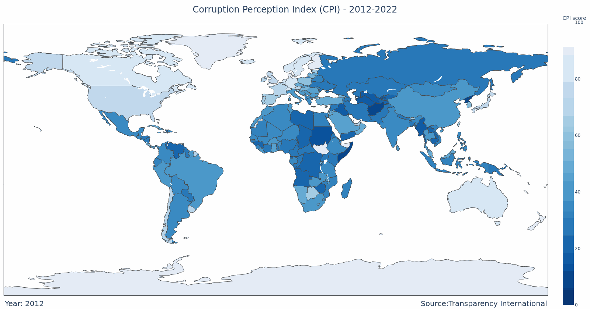
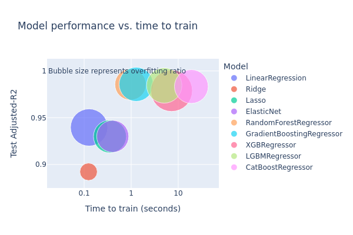
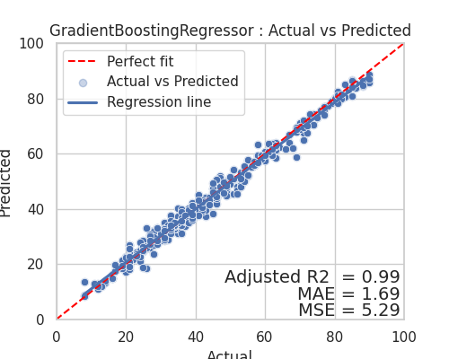
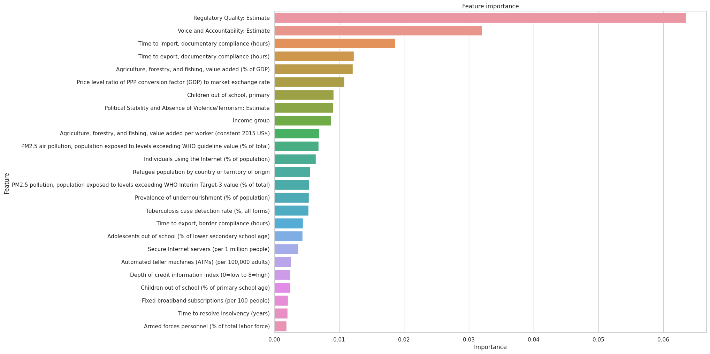

### Insights into Corruption: A Machine Learning Approach to Identify Influencing Factors

#### Initial Report and EDA

**Author**: Renaud Kilian
Data understanding and Preparation, Model building and Evaluation is provided in the [Notebook](Capstone2.ipynb).

#### Executive Summary

This project aims to identify and understand the various socio-economic and political factors influencing the Corruption Perceptions Index (CPI) at a country level. The exploration of these potential indicators might provide valuable insights into developing effective strategies to mitigate corruption and promote transparency and accountability in public sectors globally.

#### Rationale

Corruption is a pervasive issue that significantly affects economies and societies. Understanding its drivers is crucial for policy-making, international development, and global governance. This analysis can help in formulating more effective anti-corruption strategies and improving the transparency and accountability of public administrations worldwide.

#### Research Question

"Can we predict a country's Corruption Perception Index (CPI) using World Bank's Open Data indicators?"

"What are the most significant World Bank indicators that influence the Corruption Perception Index (CPI) in a country?"

This information would be vital in providing actionable insights for policy-makers and stakeholders aiming to mitigate corruption in various countries. By knowing which factors are most linked to corruption perception, targeted strategies can be developed to address those specific areas.

#### Data

For this exercise we will be using the following datasets:

1. **Corruption Perceptions Index (CPI)** - Transparency International
    - **Data Source:** [Transparency International's CPI](https://www.transparency.org/en/cpi).
    - **Description:** The CPI is a composite index that ranks countries and territories based on their public sector's perceived corruption levels. The index is formed from a combination of surveys and corruption assessments sourced from various respected institutions, making it globally recognized as a leading corruption indicator. The index is scored on a scale of 0 (highly corrupt) to 100 (very clean).
    - **Limitations:** The CPI is perception-based and does not directly measure corruption levels. Instead, it compiles data from different sources, capturing the views of business people and country experts on the public sector's corruption levels. As such, the CPI should not be viewed as a definitive judgment of a society's overall corruption levels but as an evaluation of public sector corruption.
    - **Collection Methodology:** The CPI is derived from 13 surveys and assessments from 12 independent institutions. These sources typically define corruption as "the misuse of public power for private benefit." A country must have at least three data sources available for a given year to receive a CPI score.
    - **Update Frequency:** Transparency International publishes the CPI annually.
    - **Use Note:** CPI scores prior to 2012 are not directly comparable with scores from subsequent years due to methodology changes. Thus, these scores will not be utilized in our analysis.
    
2. **World Development Indicators (WDI)** - World Bank
    - **Data Source:** [World Bank's Open Data](https://databank.worldbank.org/source/world-development-indicators)
    - **Description:** The World Bank Indicators encompass a wide range of economic, social, and environmental data about World Bank member countries and other economies. These indicators include metrics like GDP, education, health, labor, trade, and numerous others, offering comprehensive insights into various development aspects globally. Each indicator has a specific scale relevant to the data it presents. The dataset provided for this analysis contains 1,478 indicators addressing over 90 topics.
    - **Limitations:** While these indicators offer valuable insights, they come with certain limitations, including varying data quality across countries, potential errors due to statistical estimation techniques, and some data being outdated or missing for certain countries or years.
    - **Collection Methodology:** The World Bank sources data from various national and international sources, including statistical publications and databases maintained by countries, UN agencies, various international and regional organizations, and academic sources. The data undergoes rigorous quality checks before being made available on the platform.
    - **Update Frequency:** The World Bank continuously updates its datasets as fresh data becomes available, though the frequency can vary depending on the data source and indicator.

#### Methodology

Our methodology will align with the CRISP-DM framework, this report covers the business aspects (Evaluation, and Deployment).

The technical [Notebook](Capstone2.ipynb) covers the remaining phases:

**Data Understanding:** We will gather the necessary data from various sources like Transparency International, World Bank's Open Data, World Justice Project, Reporters Without Borders, UNDP, and country-specific statistical agencies. Initial data exploration will help us understand the data's quality, completeness, and relevance to our research question.

**Data Preparation:** The collected data will be pre-processed and cleaned to handle missing values, outliers, and potential transformations. This phase includes data integration where data from different sources is combined, and feature engineering to create new variables if required.

**Modeling:** We plan to experiment with various regression models including Multiple Linear Regression, Decision Tree Regression, Random Forests, Gradient Boosting, and Ridge or Lasso. Feature selection techniques will be applied to identify the most relevant predictors.

**Evaluation:** Models will be assessed based on relevant metrics such as R-squared, Root Mean Squared Error (RMSE), and Mean Absolute Error (MAE). Cross-validation techniques will be used to ensure model robustness and avoid overfitting.

#### Conclusion
Upon conducting our analysis, we discovered a high degree of correlation among the indicators derived from the World Bank's Open Data. This presented a complex and delicate challenge when it came to filtering these indicators.

Despite this, our predictive models were successful in accurately predicting the Corruption Perceptions Index (CPI). The Gradient Boosting Regressor model outperformed the rest, demonstrating a Coefficient of Determination exceeding 0.98 (with 1 indicating a perfect fit). Which translates an average error of 1.6 points on the CPI scale.

##### Answering the research question

1. "Can we predict a country's Corruption Perception Index (CPI) using World Bank's Open Data indicators?"

Yes, the World Bank's Open Data indicators have substantial predictive power for the Corruption Perceptions Index (CPI)

2. "What are the most significant World Bank indicators that influence the Corruption Perception Index (CPI) in a country?"

Due to the high degree of correlation among the indicators, it is difficult to identify the most significant indicators. However, the following indicators were found to be the most influential:

1. Regulatory Quality: Estimate
2. Voice and Accountability: Estimate
3. Time to import, documentary compliance (hours)
4. Time to export, documentary compliance (hours)
5. Agriculture, forestry, and fishing, value added (% of GDP)
6. Price level ratio of PPP conversion factor (GDP) to market exchange rate
7. Children out of school, primary
8. Political Stability and Absence of Violence/Terrorism: Estimate
9. Income group
10. Agriculture, forestry, and fishing, value added per worker (constant 2015 US$)
11. PM2.5 air pollution, population exposed to levels exceeding WHO guideline value (% of total)
12. Individuals using the Internet (% of population)
13. Refugee population by country or territory of origin
14. PM2.5 pollution, population exposed to levels exceeding WHO Interim Target-3 value (% of total)
15. Prevalence of undernourishment (% of population)
16. Tuberculosis case detection rate (%, all forms)
17. Time to export, border compliance (hours)
18. Adolescents out of school (% of lower secondary school age)
19. Secure Internet servers (per 1 million people)
20. Automated teller machines (ATMs) (per 100,000 adults)
21. Depth of credit information index (0=low to 8=high)
22. Children out of school (% of primary school age)
23. Fixed broadband subscriptions (per 100 people)
24. Time to resolve insolvency (years)
25. Armed forces personnel (% of total labor force)

##### Next Steps

- Conduct an in-depth analysis of each indicator in the World Development Indicators (WDI) dataset to further refine the selection of significant indicators. This could involve more detailed statistical tests or applying feature selection techniques to identify the most relevant indicators for predicting CPI.

- 

##### Contact and Further Information

For any inquiries or further information, please reach out to [kilren@gmail.com](mailto:kilren@gmail.com).
